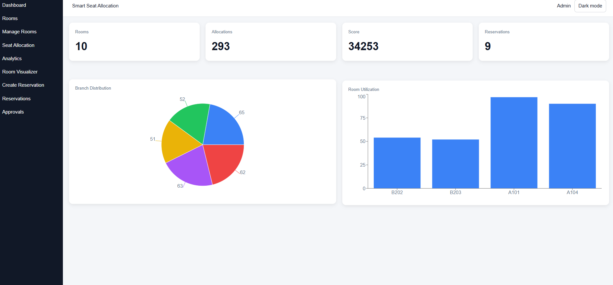
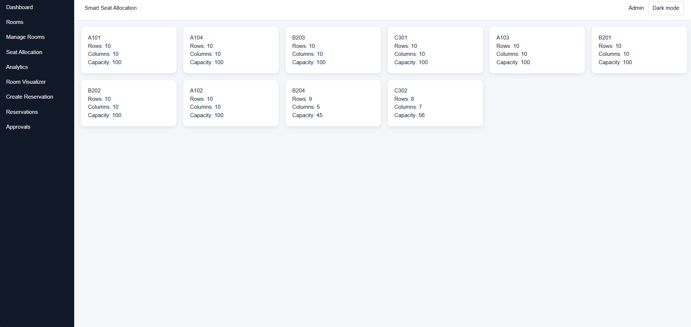
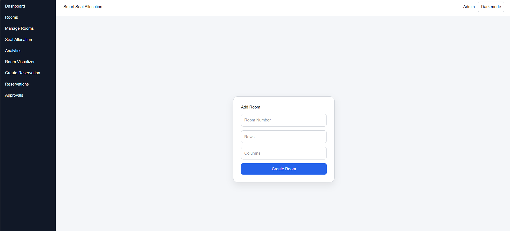
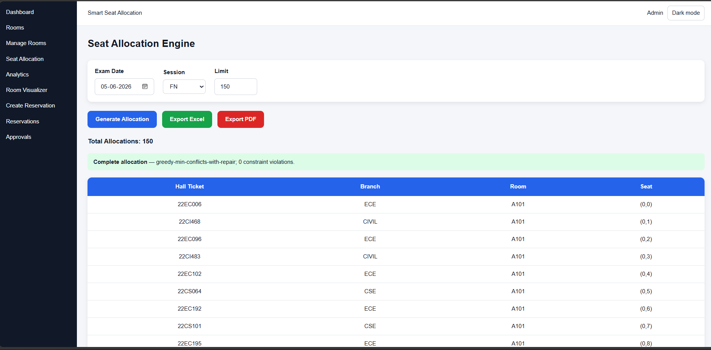
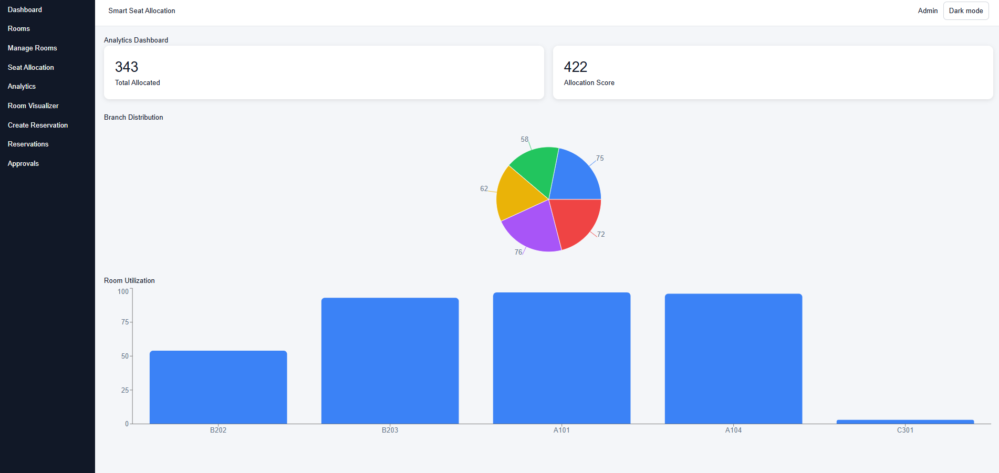
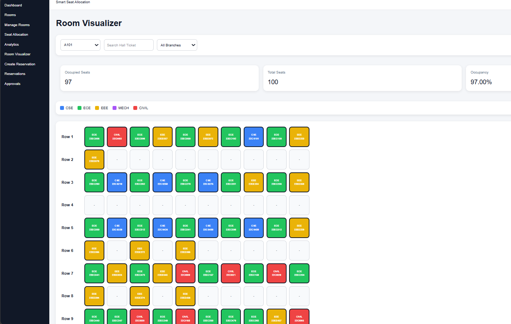
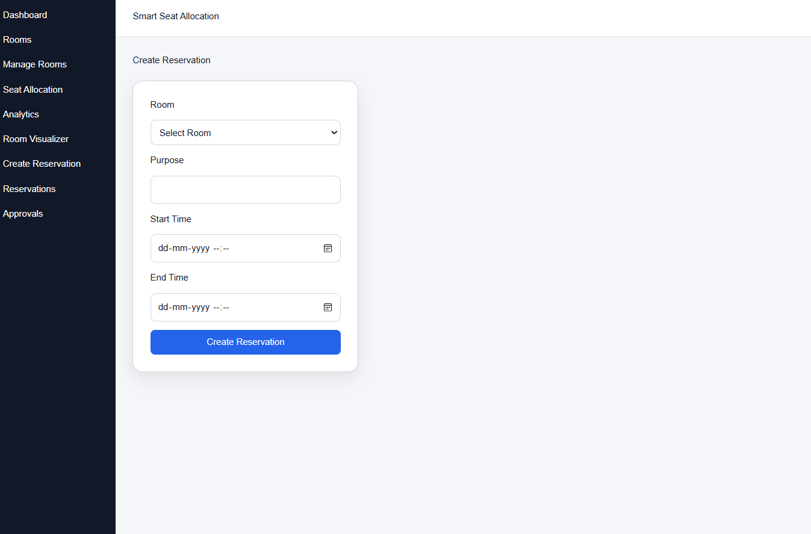
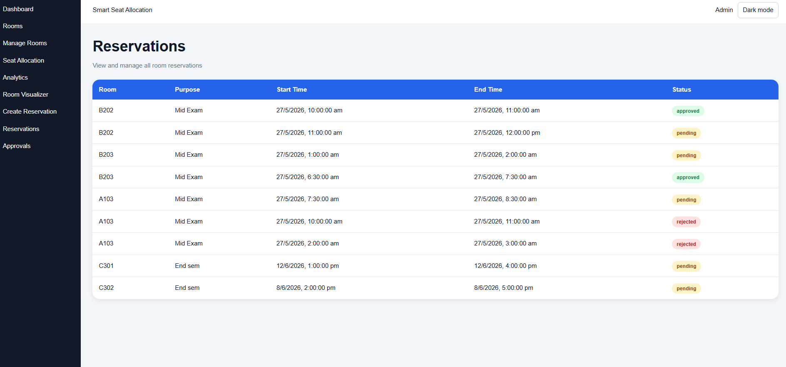
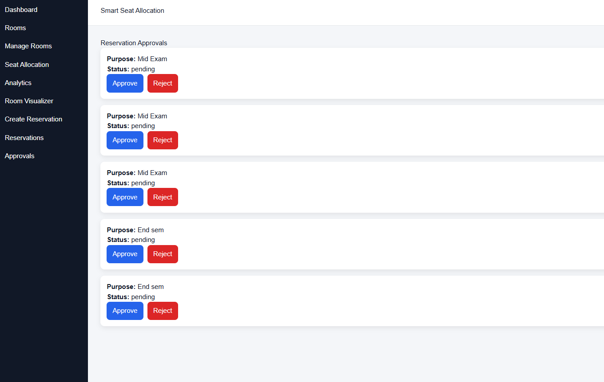

# Smart Seat Allocation System

A web-based Smart Seat Allocation System designed to simplify examination seat allocation, room management, reservations, approvals, and analytics.

The system provides an admin dashboard for managing rooms, generating optimized seat allocations, visualizing room occupancy, and managing room reservations.

## Live Demo

[Smart Seat Allocation System](YOUR_VERCEL_URL)

## Features

- Admin Dashboard
- Room Management
- Automated Seat Allocation
- Branch-wise Seat Distribution
- Room Utilization Analytics
- Interactive Room Visualizer
- Hall Ticket-wise Seat Search
- Room Reservations
- Reservation Approval and Rejection
- Excel Export
- PDF Export
- Dark Mode

## Seat Allocation

The Seat Allocation Engine generates seat assignments based on the selected examination date, session, and allocation limit.

The allocation process aims to distribute students across rooms while minimizing conflicts between students from the same branch.

## Dashboard

The dashboard provides an overview of:

- Total rooms
- Total allocations
- Allocation score
- Reservations
- Branch distribution
- Room utilization

## Application Screenshots

### 1. Admin Dashboard

The admin dashboard provides an overview of rooms, allocations, allocation scores, reservations, branch distribution, and room utilization.




### 2. Rooms

The Rooms page displays all available examination rooms along with their row, column, and seating capacity information.




### 3. Manage Rooms

Administrators can create new examination rooms by specifying the room number, number of rows, and number of columns.




### 4. Seat Allocation Engine

The Seat Allocation Engine generates examination seat assignments based on the selected examination date, session, and allocation limit.

The generated allocation can be exported in both Excel and PDF formats.




### 5. Analytics Dashboard

The Analytics Dashboard provides insights into total allocations, allocation scores, branch-wise distribution, and room utilization.




### 6. Room Visualizer

The Room Visualizer provides a graphical representation of seats within a selected examination room.

Seats are color-coded based on the student's branch, making room occupancy and branch distribution easy to understand.




### 7. Create Reservation

Administrators can create room reservations by selecting a room, specifying the purpose, and defining the start and end times.




### 8. Reservations

The Reservations page displays room reservations along with their purpose, scheduled time, and approval status.




### 9. Reservation Approvals

Administrators can review pending reservations and approve or reject them.



## Technology Stack

### Frontend

- React.js
- JavaScript
- HTML
- CSS

### Backend

- Node.js
- Express.js

### Deployment

- Vercel

## Project Structure

```text
SeatAllocationSystem/
│
├── client/
│   └── Frontend application
│
├── server/
│   └── Backend API
│
├── screenshots/
│   └── Project screenshots
│
├── package.json
├── package-lock.json
└── README.md